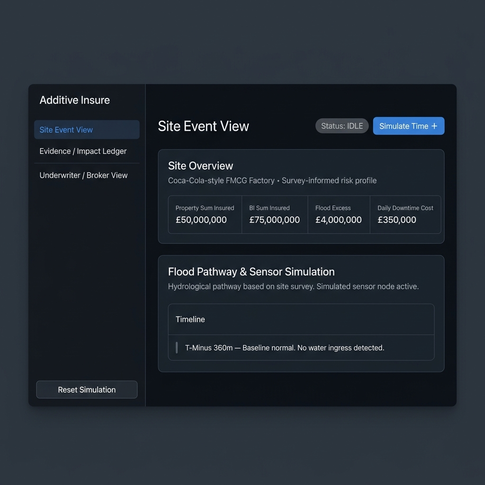
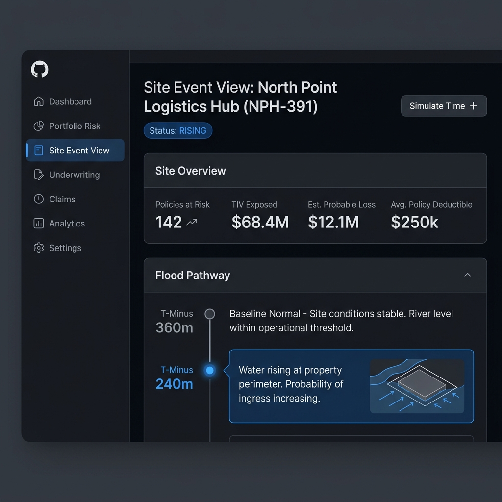
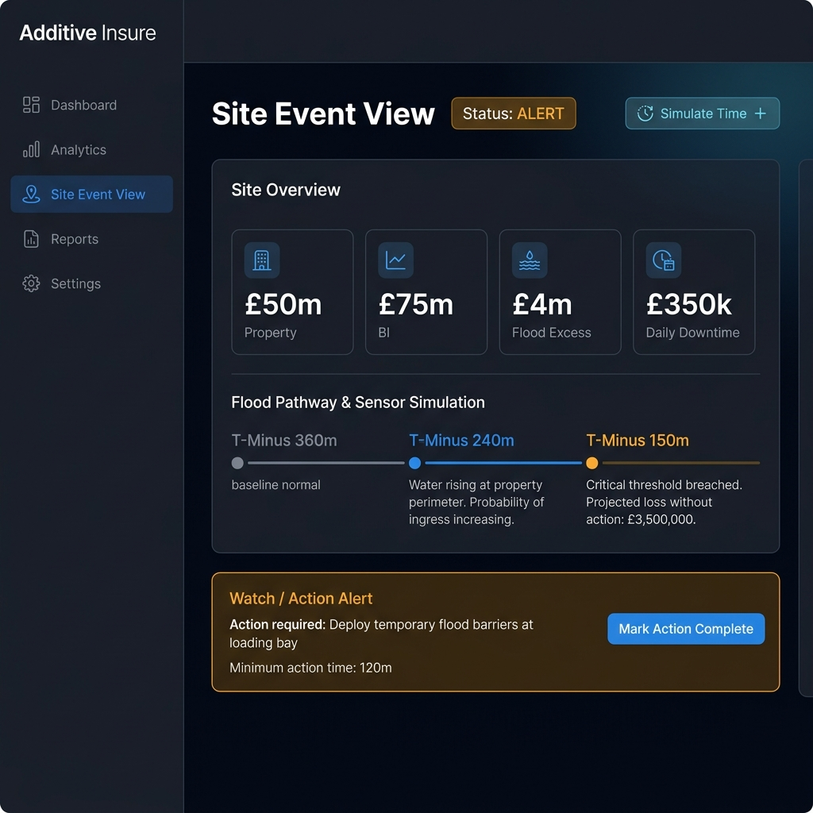
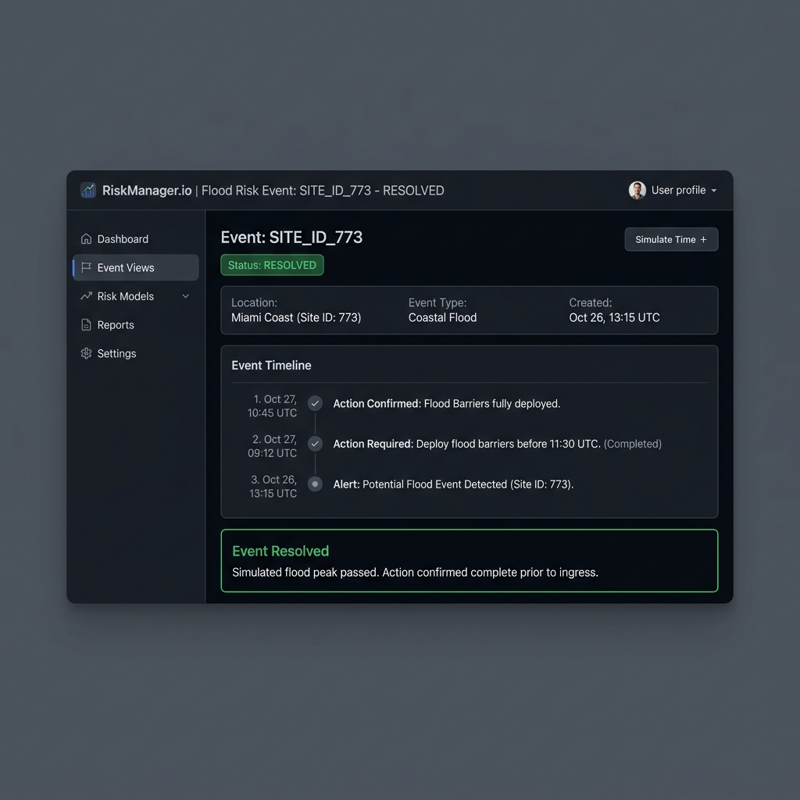
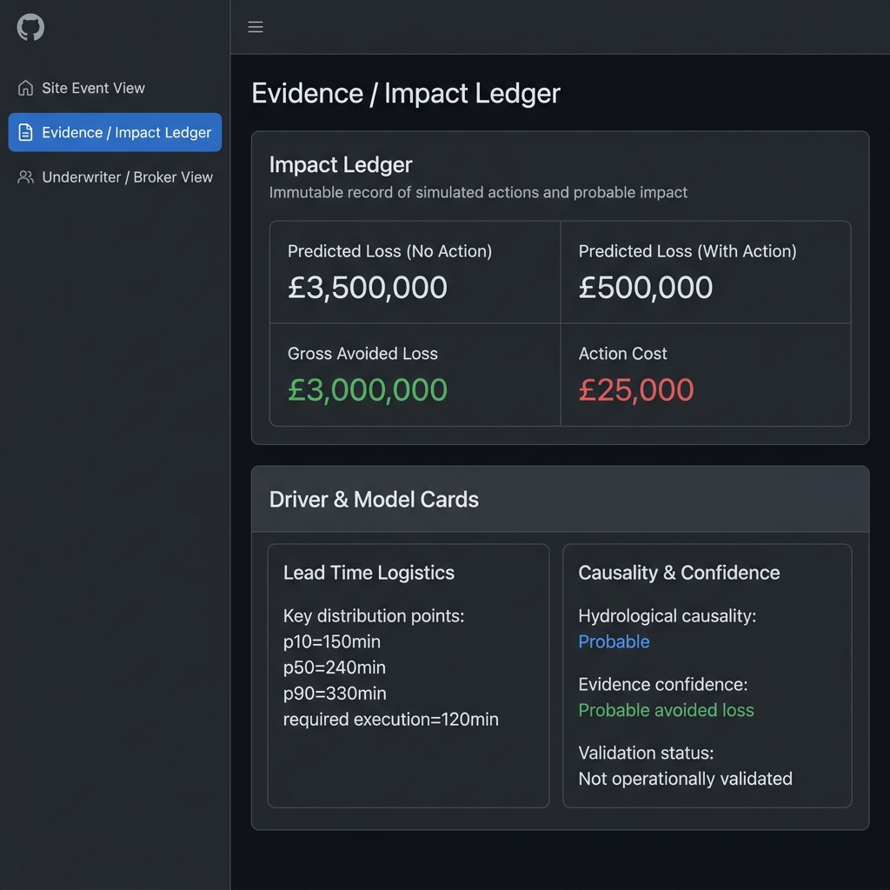
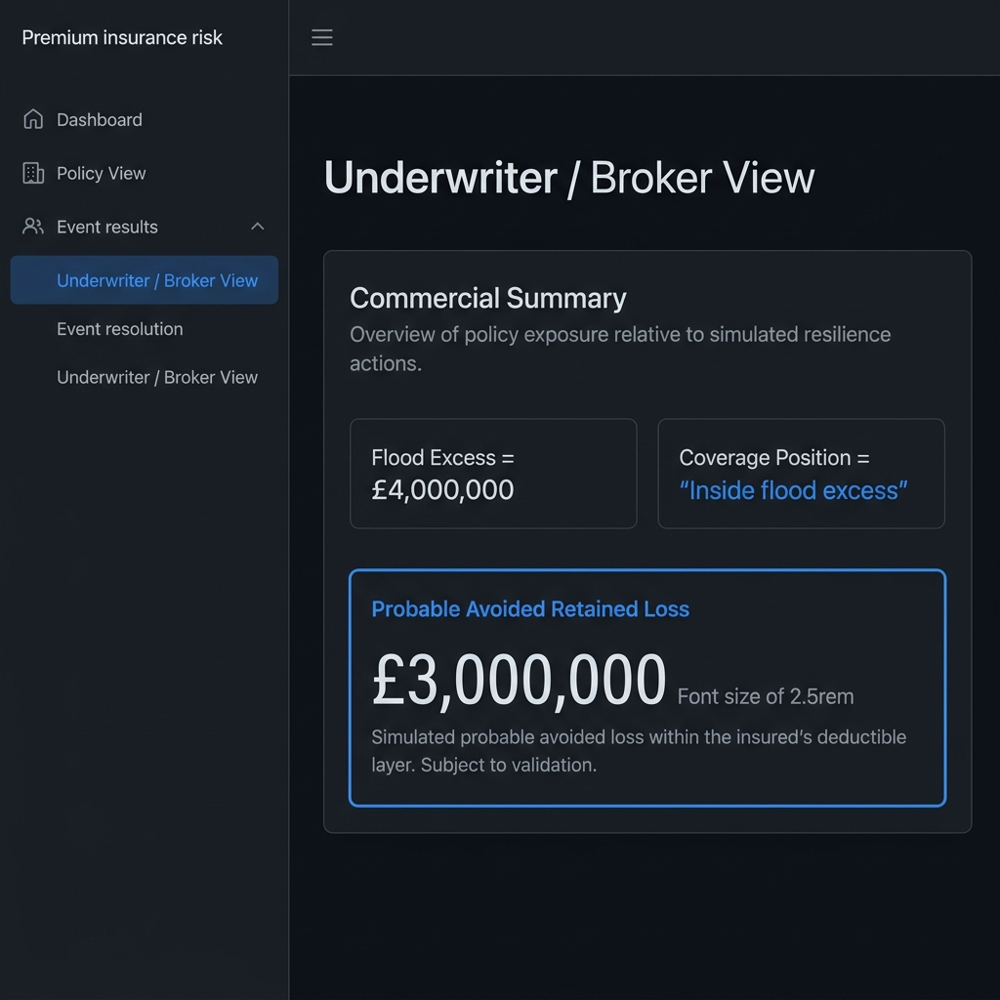
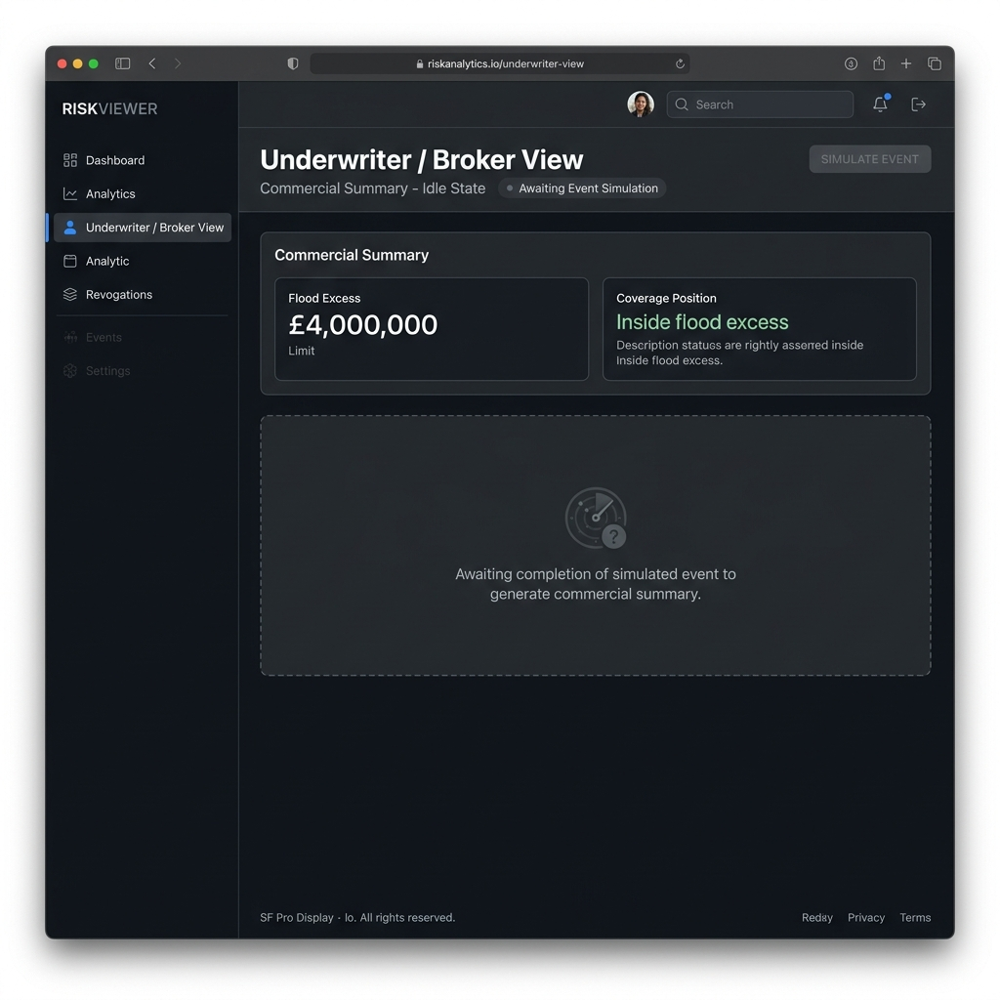

# Sprint 001 Evidence Pack
## Additive Insure — Controlled Demonstrator

**Branch:** `sprint/001-controlled-demonstrator`  
**PR:** Sprint 001: Additive Insure controlled demonstrator  
**Sprint date:** 2026-05-22 / 2026-05-23  
**Status:** Complete — ready for review  

---

## 1. Overview

Sprint 001 delivers the first end-to-end scripted demonstrator for the Additive Insure platform. It covers the primary hero journey:

> FMCG hero site → policy exposure → surveyed flood pathway → simulated readings → Watch/Action alert → action completion → avoided-loss estimate → Impact Ledger → Underwriter/Broker View

This is a **controlled demonstrator only**. All data is simulated. No live sensors, live flood models, claims workflows, or pricing engines are included or implied.

---

## 2. How to Run

### Prerequisites
- Node.js ≥ 18
- npm ≥ 9

### Local development
```bash
# From the repo root
cd app
npm install
npm run dev
# → http://localhost:5173
```

### Demo journey (no developer intervention required)
1. Open **http://localhost:5173**
2. You land on **Site Event View** — IDLE state. Review the FMCG hero site and policy exposure.
3. Click **Simulate Time +** → state advances to **RISING**. Water rising at property perimeter appears on timeline.
4. Click **Simulate Time +** again → state advances to **ALERT**. Watch/Action Alert banner appears.
5. Click **Mark Action Complete** → state moves to **ACTION TAKEN** then auto-resolves to **RESOLVED**.
6. Navigate to **Evidence / Impact Ledger** — the Impact Ledger is now populated with all avoided-loss data.
7. Navigate to **Underwriter / Broker View** — Commercial Summary shows Probable Avoided Retained Loss.
8. Click **Reset Simulation** (sidebar bottom) to replay from the beginning.

---

## 3. Application Structure

### Three Primary Screens

| Screen | Route | Purpose |
|---|---|---|
| Site Event View | Default | Scripted event timeline, sensor simulation, action centre |
| Evidence / Impact Ledger | Sidebar nav | Immutable ledger, driver/model cards, causality confidence |
| Underwriter / Broker View | Sidebar nav | Commercial summary, probable avoided retained loss |

### Component Mapping

```
App.jsx
├── SimulationContext.jsx        # State engine: IDLE→RISING→ALERT→ACTION_TAKEN→RESOLVED
├── components/SiteEventView.jsx # Screen 1
│   ├── Site Overview            # Policy exposure from fixtures/site.json
│   ├── Flood Pathway Card       # Scripted timeline / sensor simulation
│   └── Action Center            # Watch alert + Mark Action Complete control
├── components/EvidenceView.jsx  # Screen 2
│   ├── Impact Ledger            # Unlocks on RESOLVED; metric grid from fixtures/event.json
│   └── Driver & Model Cards     # Lead times, causality, confidence
└── components/UnderwriterView.jsx  # Screen 3
    └── Commercial Summary       # Probable Avoided Retained Loss, coverage position
```

---

## 4. Fixtures Confirmation

All business values are loaded from `/fixtures` — **no commercial numbers are hardcoded in React components**.

### `/fixtures/site.json`
```json
{
  "site": { "name": "Coca-Cola-style FMCG Factory" },
  "policy": {
    "propertySumInsured": 50000000,
    "businessInterruptionSumInsured": 75000000,
    "floodExcess": 4000000
  }
}
```

### `/fixtures/event.json`
```json
{
  "event": {
    "dailyDowntimeCost": 350000,
    "action": "Deploy temporary flood barriers at loading bay",
    "actionCost": 25000,
    "leadTimes": { "p10": 150, "p50": 240, "p90": 330 },
    "minimumActionTime": 120,
    "predictedLossWithoutAction": 3500000,
    "predictedLossWithAction": 500000,
    "grossAvoidedLoss": 3000000,
    "retainedLossAvoided": 3000000,
    "coveragePosition": "Inside flood excess",
    "hydrologicalCausality": "Probable",
    "evidenceConfidence": "Probable avoided loss"
  }
}
```

Components import these files directly:
- `SiteEventView.jsx` → imports `fixtures/site.json` and `fixtures/event.json`
- `EvidenceView.jsx` → imports `fixtures/event.json`
- `UnderwriterView.jsx` → imports `fixtures/site.json` and `fixtures/event.json`

---

## 5. Journey Walkthrough

### State 1 — IDLE: FMCG Hero Site & Policy Exposure

The opening view displays the hero FMCG factory with its full policy exposure:

| Metric | Value |
|---|---|
| Property Sum Insured | £50,000,000 |
| BI Sum Insured | £75,000,000 |
| Flood Excess | £4,000,000 |
| Daily Downtime Cost | £350,000 |

Flood Pathway card shows a surveyed hydrological pathway timeline, starting at T-Minus 360 minutes. Sensor simulation is described as survey-informed and simulated.



---

### State 2 — RISING: Water Rising at Perimeter

After clicking **Simulate Time +**, the badge changes to `RISING`. The timeline gains a second entry:

> **T-Minus 240m** — Water rising at property perimeter. Probability of ingress increasing.



---

### State 3 — ALERT: Watch / Action Alert

After a second **Simulate Time +**, the badge changes to `ALERT`. A third timeline entry appears:

> **T-Minus 150m** — Critical threshold breached. Projected loss without action: £3,500,000.

The **Watch / Action Alert** banner surfaces in amber, displaying:
- **Action required:** Deploy temporary flood barriers at loading bay
- **Minimum action time:** 120 minutes
- **CTA:** Mark Action Complete



---

### State 4 — ACTION TAKEN → RESOLVED: Action Completion

Clicking **Mark Action Complete** transitions the state to `ACTION_TAKEN`, then auto-resolves to `RESOLVED` after 2 seconds. The action banner turns green:

> **Event Resolved** — Simulated flood peak passed. Action confirmed complete prior to ingress.



---

### State 5 — Evidence / Impact Ledger

Navigating to the Evidence / Impact Ledger view (with event in RESOLVED state) reveals the populated ledger:

| Metric | Value |
|---|---|
| Predicted Loss (No Action) | £3,500,000 |
| Predicted Loss (With Action) | £500,000 |
| Gross Avoided Loss | £3,000,000 |
| Action Cost | £25,000 |

**Driver & Model Cards:**
- p10 lead time: 150 minutes
- p50 lead time: 240 minutes
- p90 lead time: 330 minutes
- Required execution time: 120 minutes

**Causality & Confidence:**
- Hydrological causality: Probable
- Evidence confidence: Probable avoided loss
- Validation status: Not operationally validated



---

### State 6 — Underwriter / Broker View

Navigating to the Underwriter / Broker View shows the Commercial Summary:

| Metric | Value |
|---|---|
| Flood Excess | £4,000,000 |
| Coverage Position | Inside flood excess |

**Probable Avoided Retained Loss: £3,000,000**

> Simulated probable avoided loss within the insured's deductible layer. Subject to validation.



---

### State 7 — Contrast Scenario (Before/After Reset)

After clicking **Reset Simulation**, the Underwriter / Broker View returns to its empty state:

> _"Awaiting completion of simulated event to generate commercial summary."_

This contrast provides a clear before/after narrative for meeting demonstrations.



---

## 6. Known Limitations

The following limitations are by design for Sprint 001 and are acknowledged as out of scope:

| Limitation | Status |
|---|---|
| **Simulated event only** | All sensor data, water levels, and timing are scripted. No live data. |
| **Survey-informed, not operationally validated** | Flood pathway is based on a modelled survey, not field-validated sensor placement. |
| **No live sensors** | Sensor simulation is scripted. No IoT or real-time data integration. |
| **No live flood model** | No connection to a hydrological model, NWP forecasting, or flood extent service. |
| **No claims workflow** | No first notification of loss, adjuster workflow, or claims system integration. |
| **No premium or pricing engine** | Loss avoidance data is not connected to pricing, renewal, or MRC. |
| **Hydrological uncertainty not modelled** | Lead time distributions (p10/p50/p90) are illustrative, not calibrated. |
| **Not production-permissioned** | No authentication, authorisation, or data access controls. |

---

## 7. Acceptance Criteria — Sprint 001 Status

| # | Acceptance Criterion | Status |
|---|---|---|
| AC-001 | User can run the FMCG hero journey from normal state through Watch, Action, completion, avoided-loss estimate, Impact Ledger and Underwriter/Broker View without developer intervention | ✅ Pass |
| AC-002 | All business values loaded from `/fixtures`, not hardcoded in components | ✅ Pass |
| AC-003 | Application uses three primary screens: Site Event View, Evidence / Impact Ledger, Underwriter / Broker View | ✅ Pass |
| AC-004 | Cautious product language used throughout (simulated, survey-informed, probable, subject to validation) | ✅ Pass |
| AC-005 | Reset/replay control present and functional | ✅ Pass |
| AC-006 | UI is premium, calm and credible — not sci-fi or crypto dashboard aesthetic | ✅ Pass |
| AC-007 | Known limitations documented | ✅ Pass |
| AC-008 | Build produces no errors (`npm run build` clean) | ✅ Pass |

---

## 8. Files Changed in This PR

```
app/
├── .gitignore
├── eslint.config.js
├── index.html
├── package.json
├── package-lock.json
├── vite.config.js
├── public/
│   └── favicon.svg
└── src/
    ├── App.css
    ├── App.jsx
    ├── index.css
    ├── main.jsx
    ├── SimulationContext.jsx
    └── components/
        ├── SiteEventView.jsx
        ├── EvidenceView.jsx
        └── UnderwriterView.jsx

fixtures/
├── site.json
└── event.json

evidence/sprint-001/
├── SPRINT-001-EVIDENCE-PACK.md   ← this file
└── screenshots/
    ├── 01-site-idle.png
    ├── 02-site-rising.png
    ├── 03-watch-alert.png
    ├── 04-action-complete.png
    ├── 05-evidence-ledger.png
    ├── 06-underwriter-view.png
    └── 07-contrast-reset.png
```

---

## 9. PR Instructions

**Do not merge.** Open for review only.

Reviewers should:
1. Clone the branch and run `cd app && npm install && npm run dev`
2. Walk through the scripted journey in the browser at http://localhost:5173
3. Verify all seven states listed in Section 5
4. Confirm all AC items in Section 7

---

*Evidence pack generated by Antigravity — Additive Insure Sprint 001 — 2026-05-23*
