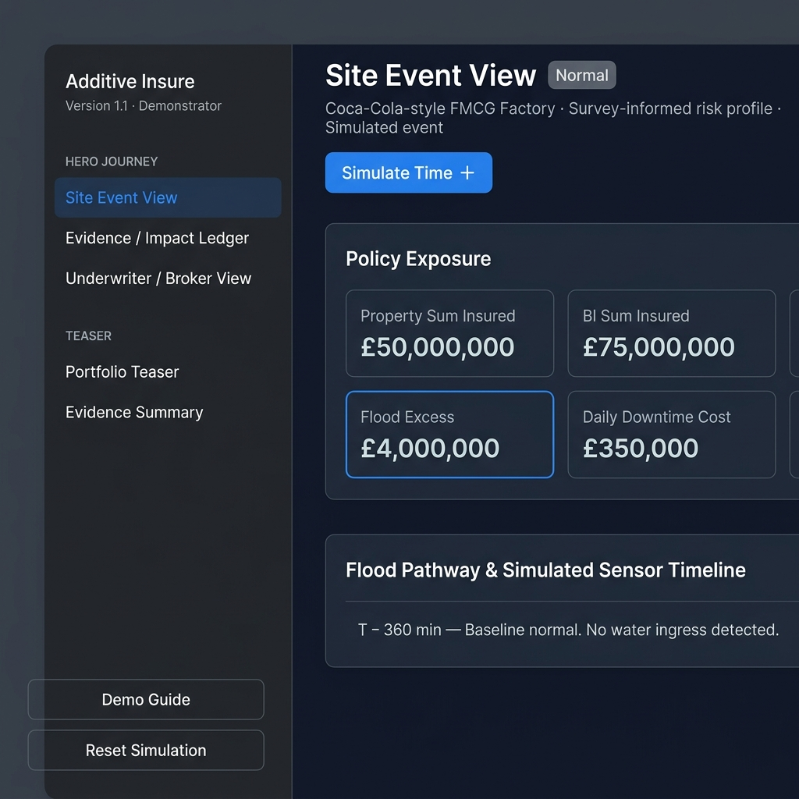
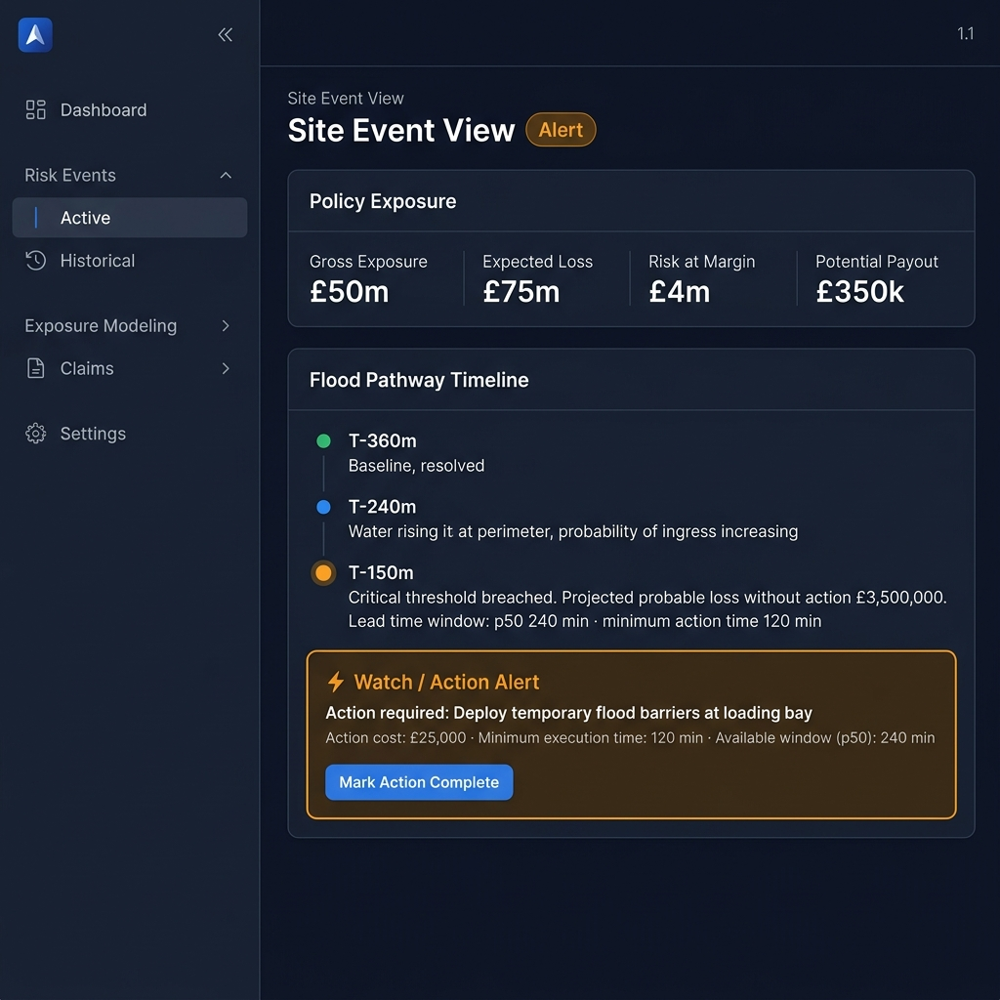
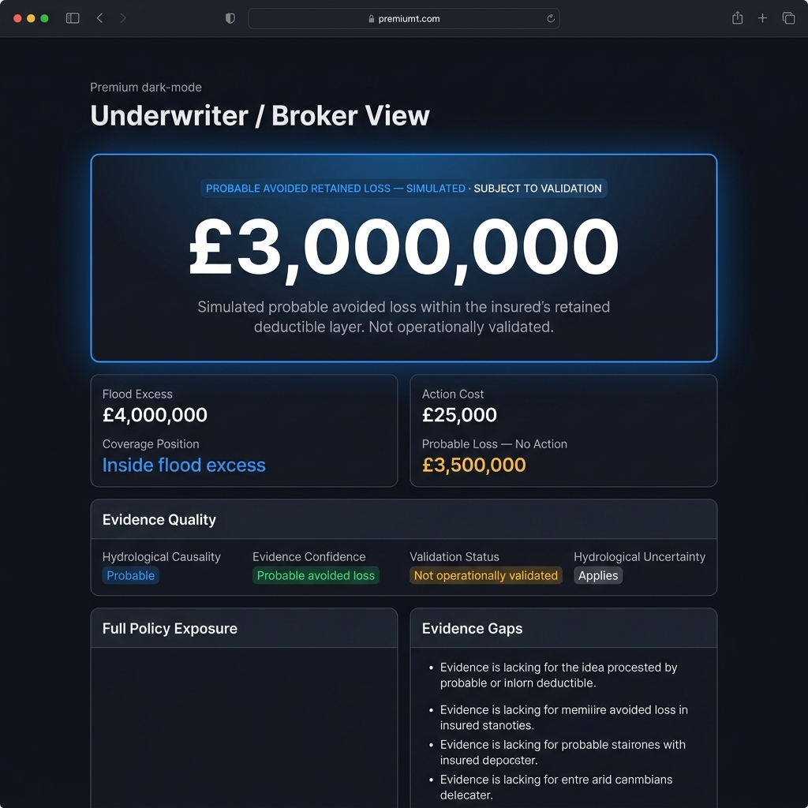
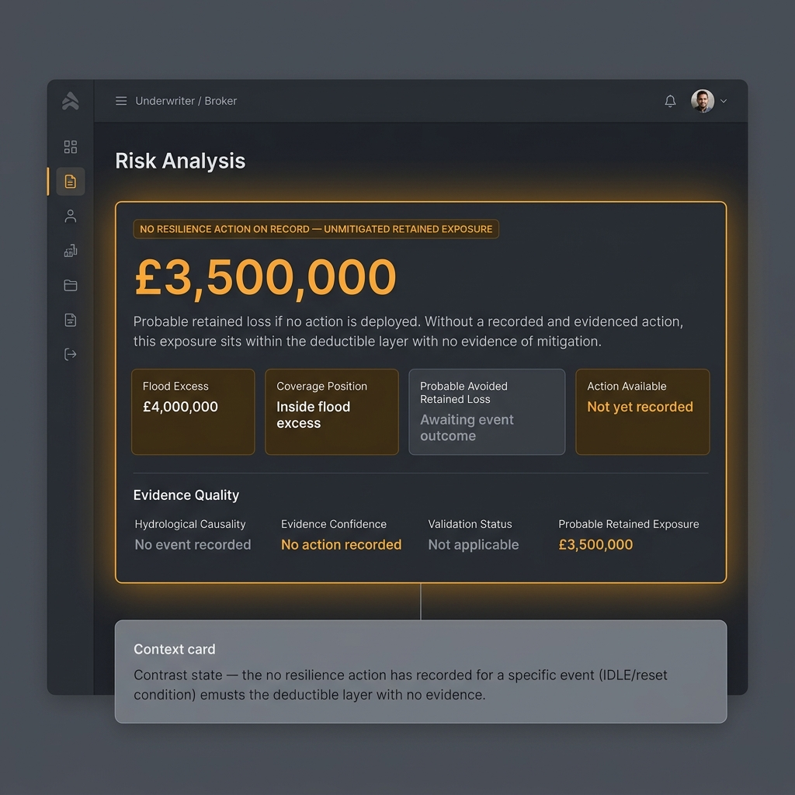
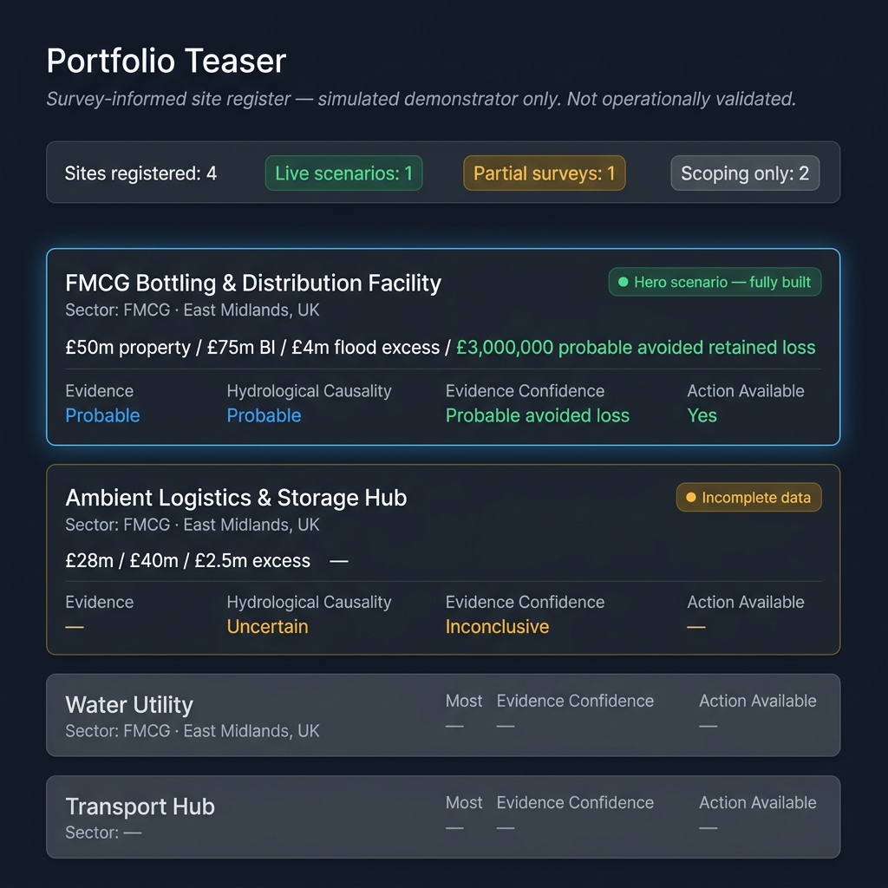
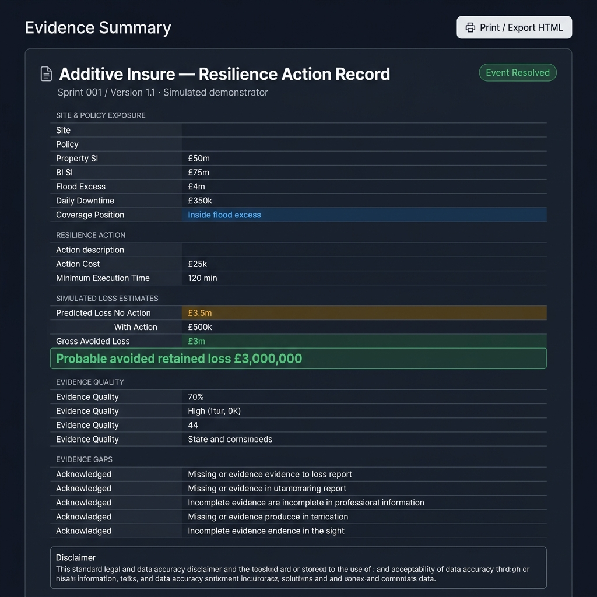
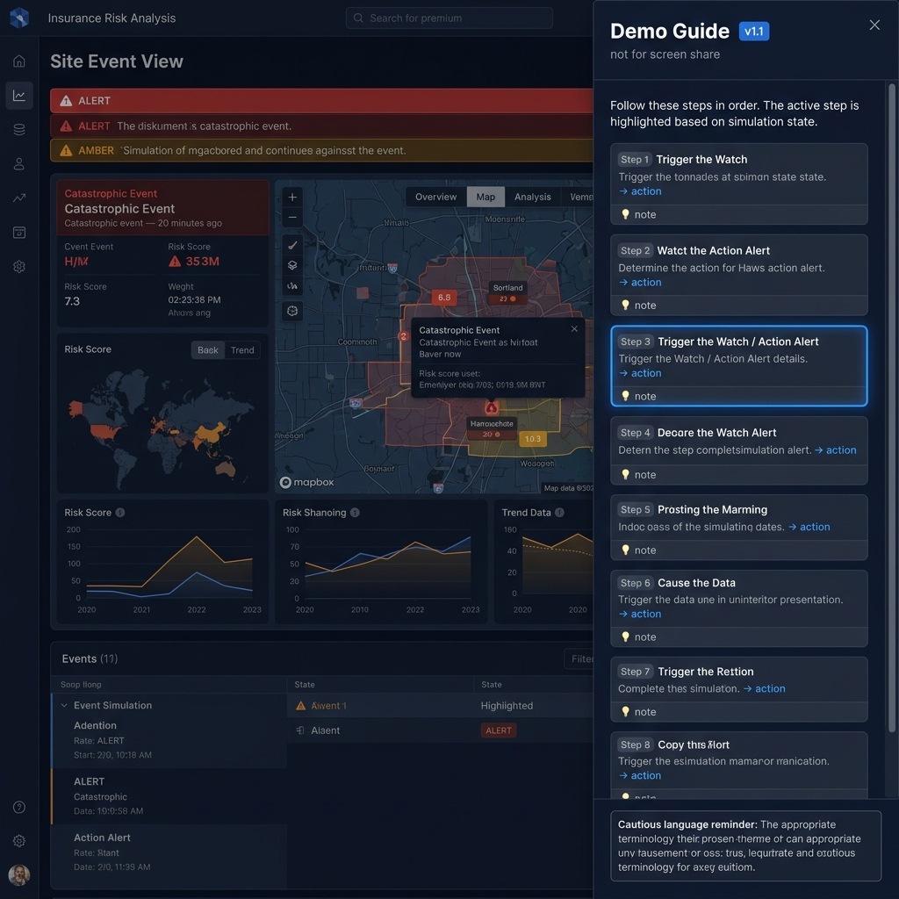

# Sprint 002 Evidence Pack
## Additive Insure — Version 1.1 Demo Readiness

**Branch:** `sprint/002-version-1-1-demo-readiness`  
**PR:** Sprint 002: Additive Insure Version 1.1 — Demo Readiness  
**Sprint date:** 2026-05-24  
**Status:** Complete — ready for review

---

## 1. Objective

Take the Sprint 001 controlled demonstrator from working prototype to meeting-ready product demo.

Focus: polish, narrative, evidence presentation, demo readiness.  
No platform expansion. No out-of-scope features.

---

## 2. How to Run

```bash
cd app
npm install
npm run dev
# → http://localhost:5173
```

**Demo journey (no developer intervention required):**

1. Open **http://localhost:5173** → Site Event View (IDLE)
2. Open **Demo Guide** (sidebar bottom) for presenter notes
3. Click **Simulate Time +** → RISING
4. Click **Simulate Time +** → ALERT — Watch/Action alert surfaces
5. Click **Mark Action Complete** → RESOLVED (Event Resolved)
6. Navigate to **Evidence / Impact Ledger** — ledger populated
7. Navigate to **Underwriter / Broker View** — meeting moment: £3m probable avoided retained loss
8. Click **Reset Simulation** → contrast scenario visible on Underwriter view
9. Navigate to **Portfolio Teaser** — 4-row site register teaser
10. Navigate to **Evidence Summary** — print-ready evidence document

---

## 3. What Changed — Sprint 002 vs Sprint 001

| Area | Sprint 001 | Sprint 002 |
|---|---|---|
| Navigation | 3 screens | 5 screens + Demo Guide panel |
| Demo Guide | None | 8-step presenter panel, context-aware active step |
| Underwriter view (resolved) | Commercial summary, one card | Hero card with dominant £3m figure, all 8 meeting-moment fields, full evidence quality strip, evidence gaps panel |
| Contrast scenario | Blank dashed placeholder | Amber hero card with £3.5m unmitigated exposure, "No action recorded" evidence confidence, inconclusive evidence quality |
| Portfolio Teaser | None | 4-row fixture-driven register: live / partial / stub / stub |
| Evidence Summary | None | Print-optimised HTML evidence document with export button |
| Design system | Basic CSS variables | Full Inter font, refined token system, semantic colour classes, print styles |
| Language | Cautious but inconsistent | Systematic cautious language, grep-verified |

---

## 4. Fixtures Confirmation

No commercial values are hardcoded in React components. All data loads from `/fixtures`:

| File | Contents |
|---|---|
| `fixtures/site.json` | Site name, property SI £50m, BI SI £75m, flood excess £4m |
| `fixtures/event.json` | Action, lead times, loss estimates, coverage position, causality/confidence |
| `fixtures/portfolio.json` | 4 portfolio rows — status, SI, excess, avoided loss, confidence |

---

## 5. Screens & Screenshots

### 01 — Site Event View (IDLE)



FMCG hero site. Policy exposure: £50m property, £75m BI, £4m flood excess, £350k daily downtime. Version 1.1 sidebar with grouped navigation and Demo Guide button visible.

---

### 03 — Watch / Action Alert (ALERT)



3-entry timeline active. Amber action banner: action required, £25k cost, 120 min minimum, p50 window 240 min. "Mark Action Complete" CTA visible.

---

### 04 — Underwriter / Broker View — Meeting Moment (RESOLVED)



Hero card with dominant **£3,000,000** probable avoided retained loss figure. Supporting metrics: flood excess £4m, action cost £25k, coverage position, no-action loss £3.5m. Evidence quality row: hydrological causality Probable (blue), evidence confidence Probable avoided loss (green), not operationally validated (amber). Evidence gaps listed below.

---

### 05 — Contrast Scenario (IDLE/Reset)



Amber hero card: **£3,500,000** unmitigated probable retained exposure. Evidence confidence "No action recorded" (amber). Hydrological causality "No event recorded" (grey). A context card explains the £3m gap. This is a credible lower-confidence state, not a blank placeholder.

---

### 06 — Portfolio Teaser



4 rows: FMCG hero (live, blue, £3m avoided loss), Logistics contrast (partial, amber, inconclusive), Water utility stub (grey), Transport hub stub (grey). Evidence confidence clearly differentiated per site.

---

### 07 — Evidence Summary (Print)



Structured print-optimised evidence document. All fixture values. Probable avoided retained loss callout in green. 5 evidence gaps acknowledged. Disclaimer footer. Print / Export HTML button.

---

### 08 — Demo Guide (Presenter Panel)



8-step presenter panel. Context-aware: active step highlighted based on simulation state. Each step shows heading, narrative, → action, and 💡 presenter note. Cautious language reminder at bottom. Marked "not for screen share".

---

## 6. Language Audit

Grep sweep across `app/src/` for all restricted terms:

```
proven | guaranteed | validated prediction | loss prevented | savings achieved | premium reduction | claims avoided
→ 0 matches
```

Terms in active use:
- simulated · survey-informed · probable · potential
- subject to validation · not operationally validated
- hydrological uncertainty applies · probable avoided retained loss
- evidence-qualified · probable impact

---

## 7. Known Limitations

| Limitation | Note |
|---|---|
| Simulated event only | All sensor data, water levels and timing are scripted |
| Survey-informed pathway | Not field-validated sensor placement |
| No live sensors | No IoT or real-time data |
| No live flood model | No NWP, EA or flood extent integration |
| No claims workflow | Out of scope |
| No premium or pricing engine | Out of scope |
| Hydrological uncertainty not modelled | Lead time distributions are illustrative |
| Not production-permissioned | No auth/RBAC |
| PDF export | Not implemented — HTML print only |
| Portfolio rows 2–4 | Simulated only — no real site data |

---

## 8. Confirmation — No Out-of-Scope Features Added

| Feature | Status |
|---|---|
| Real sensor integration | ✗ Not built |
| Live flood model | ✗ Not built |
| EA / Met Office APIs | ✗ Not built |
| Authentication or role permissions | ✗ Not built |
| Claims workflow | ✗ Not built |
| Pricing or premium engine | ✗ Not built |
| Full portfolio analytics | ✗ Not built — teaser only |
| Generic admin configuration | ✗ Not built |

---

## 9. Acceptance Criteria — Version 1.1

| # | Criterion | Status |
|---|---|---|
| AC-001 | Demo Guide / presenter panel present with full journey steps | ✅ Pass |
| AC-002 | Underwriter view: meeting moment visually dominant | ✅ Pass |
| AC-003 | All 8 meeting-moment fields visible on Underwriter view | ✅ Pass |
| AC-004 | Contrast scenario: lower-confidence/inconclusive, not blank | ✅ Pass |
| AC-005 | Portfolio teaser: 4 rows, fixture-driven, status differentiated | ✅ Pass |
| AC-006 | Evidence summary: print-optimised, all fixture values, export button | ✅ Pass |
| AC-007 | Language audit: 0 restricted terms found in components | ✅ Pass |
| AC-008 | All business values loaded from /fixtures, not hardcoded | ✅ Pass |
| AC-009 | npm run build clean | ✅ Pass |
| AC-010 | No out-of-scope platform features added | ✅ Pass |
| AC-011 | Reset/replay functional | ✅ Pass |
| AC-012 | Evidence pack committed to evidence/sprint-002/ | ✅ Pass |

---

*Evidence pack generated by Antigravity — Additive Insure Sprint 002 / Version 1.1 — 2026-05-24*
